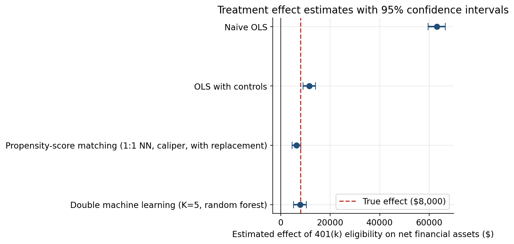

# Double Machine Learning for a Causal Effect: Does 401(k) Eligibility Raise Wealth?

## Interactive dashboard

Results are easiest to explore in the interactive dashboard: https://anurag-nepal-portfolio.vercel.app/ai-lab/causal-double-ml/

## Problem

Does being eligible for a 401(k) retirement plan increase a household's net financial assets? This is the classic example from Wooldridge's econometrics textbook, and it is hard for one reason: **confounding**. Workers offered a 401(k) tend to be richer, older, and more educated than workers who are not. A raw comparison of average wealth mixes up the effect of the 401(k) with the effect of being the kind of person who gets offered one.

## Data: simulated, stated up front

The dataset in `data/401k_simulated.csv` is **simulated**. The classic Wooldridge 401k file was attempted from four public CSV mirrors on 2026-10-02 and every attempt failed (404 or an HTML page instead of data; see `data/build_data.py` for the URLs). So the data were generated from a fully documented data-generating process (DGP) in `data/build_data.py`, with a **known true average treatment effect of $8,000**.

The DGP, in plain terms:

- Confounders X: household income (lognormal, median ~$60k), age (25-64), years of education, family size, married (yes/no), IRA participation (yes/no), home ownership (yes/no). n = 8,000.
- Treatment D (401(k) eligibility): each worker's eligibility probability rises with income, age, education, marriage, IRA holding, and home ownership (logit model plus noise). This is the confounding: X drives both D and Y. Eligibility rate is 77%; probabilities are bounded away from 0 and 1 so every type of worker has some chance of being in either group (overlap).
- Outcome Y (net financial assets): a baseline function of X **plus $8,000 times eligibility** plus noise. The income effect is deliberately concave (a square-root term: diminishing returns to income), so a linear model in income cannot fully capture it. This is what makes OLS with linear controls miss some confounding.

Because the truth is known, every method below is judged on **bias** (estimate minus $8,000) and on whether its 95% confidence interval covers the truth. Seed 20261002 everywhere; `python3 data/build_data.py` reproduces the CSV exactly.

## Methods

| Method | What it does | Statistical justification |
|---|---|---|
| Naive OLS | Regress wealth on eligibility only | Valid only if eligibility were randomly assigned. It is not. |
| OLS with controls | Regress wealth on eligibility + all confounders, linearly | Valid only if the confounders affect wealth linearly. They do not (concave income effect). |
| Propensity-score matching | Estimate each worker's eligibility probability by logistic regression; match each eligible worker 1:1 to the nearest non-eligible worker (with replacement, caliper 0.2 SD of the logit score); average the within-pair wealth differences | Valid if eligibility is as good as random given the observed confounders (unconfoundedness) and every worker type has a match (overlap). Balance is checked, not assumed. |
| Double machine learning | K-fold cross-fitting: learn E[wealth\|X] and E[eligibility\|X] out-of-fold with random forests, then regress the wealth residuals on the eligibility residuals; heteroskedasticity-robust SE | The residual-on-residual regression removes confounding without assuming a functional form for it; cross-fitting keeps the ML step honest. Valid under the same unconfoundedness and overlap assumptions, plus the ML models learning the nuisance functions well enough. |

The DML implementation is written by hand with scikit-learn (no econml): see `src/estimators.py`.

## Key results

Estimates of the effect of 401(k) eligibility on net financial assets (true effect: **$8,000**):

| Method | Estimate | 95% CI | Bias | CI covers truth |
|---|---|---|---|---|
| Naive OLS | $63,085 | [$59,621, $66,549] | +$55,085 | No |
| OLS with controls | $11,542 | [$9,006, $14,077] | +$3,542 | No |
| Propensity-score matching | $6,287 | [$4,536, $8,039] | -$1,713 | Yes |
| Double machine learning (K=5, random forest) | $7,768 | [$5,210, $10,326] | -$232 | Yes |



What this means:

- The naive comparison is wrong by a factor of eight. Almost all of it is selection: eligible workers earn on average $79,209 vs $46,439 for the non-eligible, and are older and more educated.
- Linear controls remove most of the bias but leave +$3,542, because the concave income effect is not a straight line.
- Matching works once balance is actually achieved. Matching *with replacement* plus a caliper brought every covariate's standardized mean difference under 0.07 (income went from 0.84 to 0.00); matching without replacement had left income at 0.71 and would have been unreliable.
- DML is the closest to the truth (bias -$232) and is stable: six configurations (random forest vs gradient boosting, K = 2/5/10) give estimates between $7,527 and $8,208, and every interval covers $8,000.

A Monte Carlo study (30 fresh datasets, n = 4,000 each) confirmed the pattern; see REPORT.md for the bias and coverage table.

## Limitations and threats to validity

- **Unconfoundedness cannot be verified.** Every method assumes we measured everything that drives both eligibility and wealth. If something unmeasured (financial literacy, employer generosity) affects both, all four estimates are biased and no method on these data can fix that.
- **Simulated data.** The DGP is realistic but invented. The methods and the comparison are real; the numbers describe the simulation, not the US labor market.
- **Matching SEs are optimistic.** The paired standard error treats the matches as fixed and the propensity score as known. The Monte Carlo study makes this concrete: matching's paired interval covers the true effect in only 43% of replications (vs ~90% for DML), because reusing controls as independent observations understates uncertainty. Abadie-Imbens standard errors are the standard fix; see REPORT.md.
- **Constant treatment effect.** The DGP fixes the effect at $8,000 for everyone; real effects vary across workers.

## How to run

```bash
cd causal-double-ml
python3 data/build_data.py        # reproduce data/401k_simulated.csv (seed 20261002)
python3 src/monte_carlo.py        # Monte Carlo study -> data/mc_results.json
jupyter nbconvert --to notebook --execute notebooks/analysis.ipynb \
    --output notebooks/analysis.ipynb --allow-errors
# or open notebooks/analysis.ipynb in Jupyter and run it
```

Requires Python 3 with numpy, pandas, scikit-learn, scipy, matplotlib (plotly only for the dashboard, loaded from CDN in the browser).

## Repo structure

```
causal-double-ml/
  data/
    build_data.py        # documented DGP + failed fetch attempts; reproduces the CSV
    401k_simulated.csv   # n=8000 simulated dataset (true ATE = $8,000)
    main_results.json    # the four headline estimates
    sensitivity_results.json
    mc_results.json      # Monte Carlo bias/coverage study
  src/
    estimators.py        # naive OLS, OLS+controls, propensity matching, manual DML
    plotting.py          # forest plot, balance plot, confounding, sensitivity figures
    monte_carlo.py       # repeated-simulation bias/coverage study
  notebooks/
    analysis.ipynb       # executed narrative analysis (the full story)
  figures/
    forest_plot.png      # the four estimates with 95% CIs
    balance_plot.png     # covariate balance before/after matching
    confounding.png      # income vs eligibility: the confounding, shown
    sensitivity.png      # DML across learners and fold counts
  dashboard.html         # self-contained Plotly dashboard (Overview/Methods/Results/Limitations)
  README.md
  REPORT.md              # full write-up with all tables and references
```
